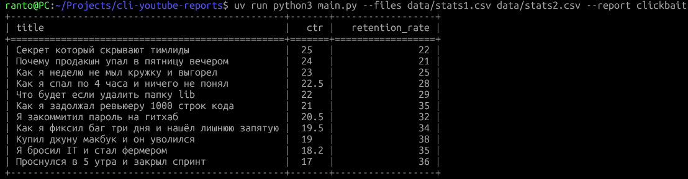
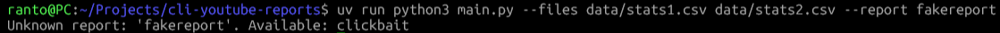
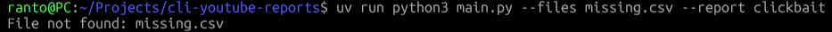
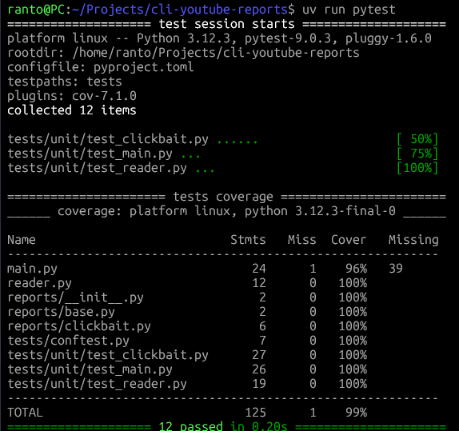

# CLI YouTube Reports

CLI-приложение для анализа метрик YouTube-видео из CSV-файлов.

## Установка

Основные зависимости:
```bash
uv sync
```

Для разработки и тестов:
```bash
uv sync --extra dev
```

## Запуск

```bash
uv run python main.py --files data/stats1.csv data/stats2.csv --report clickbait
```

## Пример вывода

### Успешная генерация отчета


### Ошибка: неизвестный тип отчёта


### Ошибка: несуществующий файл


## Тесты

```bash
uv run pytest
```

### Результаты тестов
